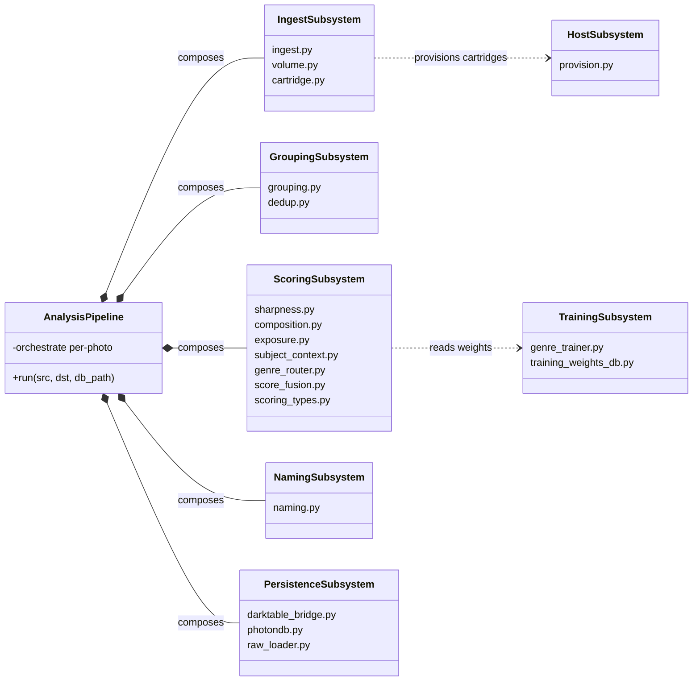
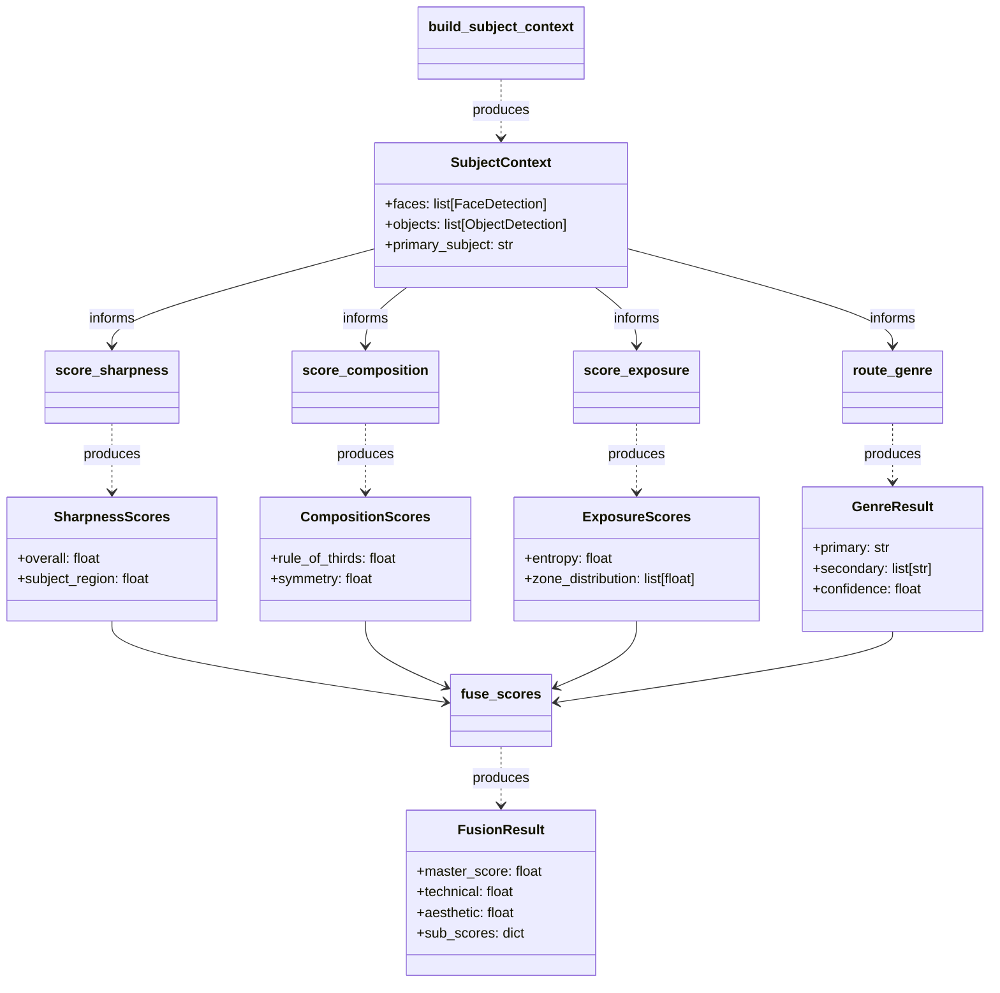
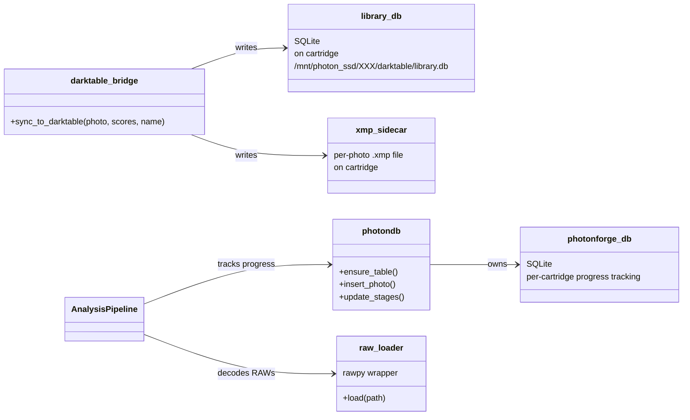
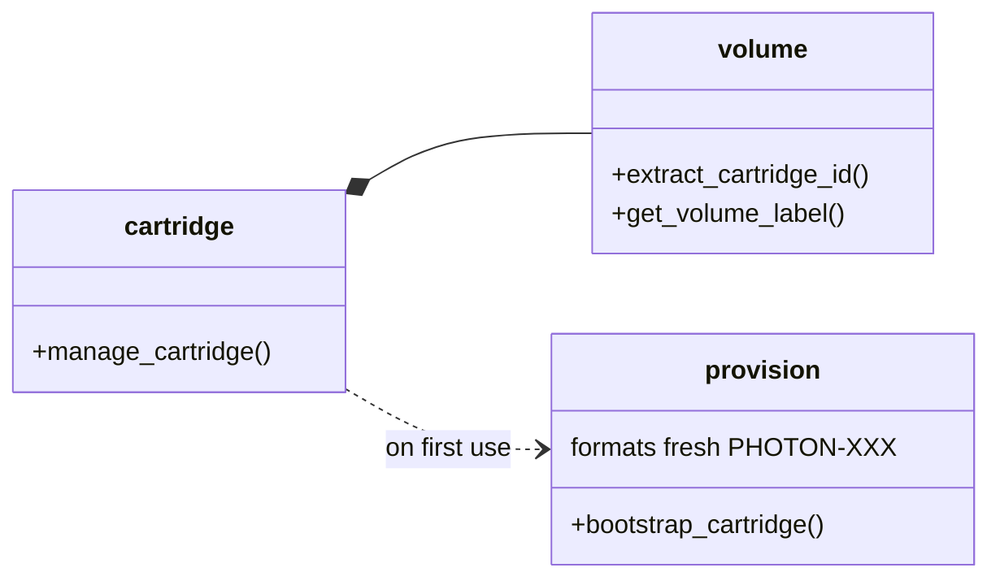

# Module Block Definition Diagram

The SysML **Block Definition Diagram (BDD)** for `src/photo_workflow/`.
Shows the structural composition: which modules contain / compose
which, and the typed «flow items» (dataclasses from
`scoring_types.py`) that travel between them.

This is the "what's in the box" view. For "what flows through the box,"
see [pipeline-activity.md](pipeline-activity.md).

## Top-level composition

`*--` is composition (subsystems belong to AnalysisPipeline);
`..>` is dependency (a read-only reference).

## Scoring subsystem — internal block diagram

This is the «definition» layer — every typed dataclass shown here is
the «flow item» on the corresponding arrow in
[pipeline-activity.md](pipeline-activity.md).

## Persistence subsystem

## Cartridge subsystem

## SysML traceability

| Block | Implements | Verified By |
|---|---|---|
| `IngestSubsystem` | FR-1.1 | KPM-1.1, tests/test_ingest.py |
| `GroupingSubsystem` | FR-1.2, FR-1.3 | KPM-1.6, KPM-1.10, tests/test_grouping.py, tests/test_dedup.py |
| `ScoringSubsystem` | FR-1.4, FR-1.5, FR-1.6, FR-1.7.1, FR-1.7.2 | KPM-1.8, tests/test_sharpness.py, tests/test_composition.py, tests/test_exposure.py |
| `NamingSubsystem` | FR-1.7 | KPM-1.2, KPM-1.7, tests/test_naming.py |
| `PersistenceSubsystem` | FR-1.8, NFR-2.3 | tests/test_darktable.py, tests/test_photondb.py |
| `cartridge` subsystem | FR-1.9, FR-1.10, NFR-2.3 | KPM-1.4, tests/test_cartridge.py |

The V&V matrix in `dev-docs/photonforge-architecture.md` §3.4 is the
machine-readable form of this table; this diagram is the «structural»
view of the same evidence.
