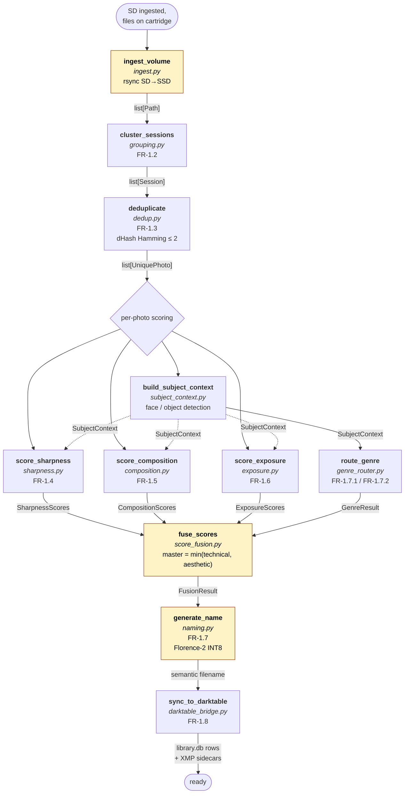

# Pipeline Activity Diagram

The SysML **Activity Diagram** of the analysis pipeline (the `ingesting
→ ready` arc of the ingest session — see
[system-state-machine.md](system-state-machine.md)).

This is the actual DAG of work `AnalysisPipeline` orchestrates against
a freshly-staged batch of photos. Arrows are control flow; labels on
arrows are «flow items» (typed dataclasses from
`src/photo_workflow/scoring_types.py`).

## Parametric constraints (KPMs)

| Block | KPM | Constraint | Owner |
|---|---|---|---|
| `ingest_volume` | KPM-1.1 | rsync rate ≥ 80% USB 3.0 BW | @devops |
| `cluster_sessions` | KPM-1.10 | grouping precision ≥ 90% F1 | @engineer |
| `deduplicate` | KPM-1.6 | false-positive rate ≤ 1% | @engineer |
| `generate_name` | KPM-1.2 | ≤ 2.5 s/image | @engineer |
| `generate_name` | KPM-1.7 | naming output validity ≥ 95% | @engineer |
| `fuse_scores` | KPM-1.8 | scoring determinism: variance ≤ 0.01 on identical re-run | @engineer |
| entire flow | KPM-1.3 | peak RSS ≤ 1.5 GB | @engineer |
| entire flow | KPM-1.5 | end-to-end throughput ≥ 10 photos/min | @engineer |
| entire flow | KPM-1.9 | peak CPU ≤ 80% of cores | @devops |

## Concurrency notes

- The four sub-scoring branches (`sharp`, `comp`, `expo`, `subj`) are
  **logically parallel** — each consumes the same input photo and
  produces an independent typed score. The current implementation runs
  them sequentially per-photo to stay inside the KPM-1.3 RSS budget;
  parallelism is reserved for batch-level (different photos in flight),
  not per-photo (different scores in flight).
- `subj` (`build_subject_context`) feeds both `genre` and (dashed lines)
  the three sub-score modules — face/object context informs the
  scoring rubrics. This is the "subject-aware scoring" architecture
  documented in `architecture/subject-enabled-subscores.md`.
- `fuse_scores` is the only point where heterogeneous score types meet.
  It is the SysML **synchronization bar** of this activity diagram.

## SysML traceability

This diagram is the «satisfy» evidence for the FRs listed in the FR
block labels. Each block carries the FR-ID it implements. The KPM table
above is the «parametric constraint» layer — the same blocks
participate in measurable constraint blocks that the V&V matrix
references (see `dev-docs/architecture/vv-matrix.md`).
