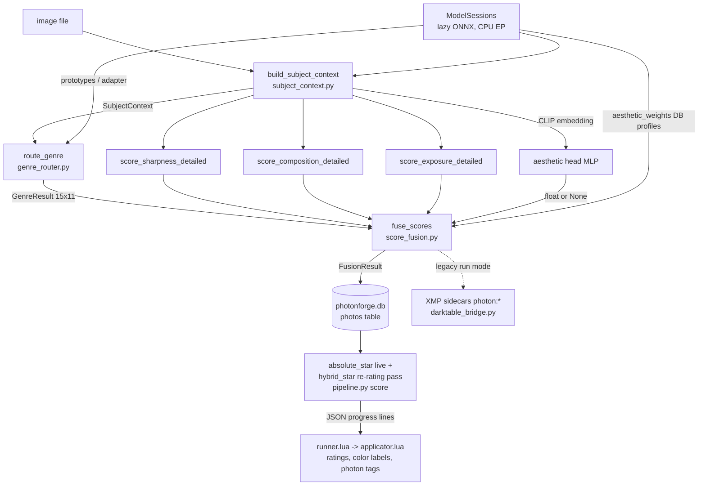

# Scoring Architecture — As Built

**Status:** living (as-built reference)
**Date:** 2026-07-10
**Owner:** @systems_lead (design) / @software_lead (implementation)

This is the authoritative description of the scoring system **as implemented**
in `src/photo_workflow/score_fusion.py` and its neighbors. The originally
planned five-module split (`region_router` → `sub_scores/*` → `technical_gate`
+ `aesthetic_weighter` → `fusion`) was never built — see
[ADR-001](adr/ADR-001-stage6-five-module-split-superseded.md). The archived
design docs
([scoring-module-contracts.md](../Archive/architecture/scoring-module-contracts.md),
[stage-6-engineer-brief.md](../Archive/architecture/stage-6-engineer-brief.md),
[subject-enabled-subscores.md](../Archive/architecture/subject-enabled-subscores.md))
are history, not spec. This doc absorbs the *corrected* form of the
subject-enabled-subscores idea: not-applicable signals are dropped and the
remaining weights renormalized (see §6), rather than routed through a
`RegionSpec` that never existed.

Interface registrations: `requirements/interfaces/IF-2.1.md` (fusion boundary),
`IF-3.1.md` (genre routing), `IF-3.2.md` (Darktable bridge / XMP-tag namespace).

## 0. Data flow



One shared implementation, `pipeline.score_one()`, runs this chain for both
the legacy full-run pipeline (`AnalysisPipeline.run`) and the staged
`photo-workflow score` command.

## 1. SubjectContext — all models run once per image

`subject_context.build_subject_context(path, model_sessions)` produces one
`SubjectContext` (`scoring_types.py`) consumed by every downstream stage, so
no model runs twice:

- **Image load** — `raw_loader.load_rgb` for RAW formats (cv2 reads the broken
  embedded thumbnails in ARW/CR2), `cv2.imread` for JPG/PNG with a raw_loader
  fallback. BGR, gray, and RGB views plus a 384-px thumbnail are kept.
- **EXIF** (`exifread`) — focal_length, aperture, shutter, iso, camera_model.
- **RMBG-1.4** (`models/rmbg14_int8/`, 320-px input) — binary subject mask
  (threshold 0.5) resized to full resolution; `subject_area_ratio` derived.
- **YuNet** (`models/yunet/`) — faces with 5-point landmarks, confidence ≥ 0.5.
- **YOLOv8n** (`models/yolov8n_int8/`, 640-px input) — COCO-80 detections,
  confidence ≥ 0.3, followed by per-class NMS (IoU 0.45; class-offset boxes so
  classes never suppress each other). `primary_subject_bbox` = largest box.
- **MobileCLIP-S2 vision encoder** (`models/mobileclip_s2_int8/`, 256-px,
  identity normalization) — L2-normalized 512-d embedding, reused by genre
  routing, the aesthetic head, and active learning.
- **sharpness_contrast** — subject-Tenengrad / background-Tenengrad computed
  from 2-D Sobel gradient maps *before* mask indexing.

`ModelSessions` (same module) holds lazy, long-lived onnxruntime sessions
(**CPUExecutionProvider only**) and also resolves:

- **aesthetic head** — `aesthetic_mlp.onnx` under `models/clip_aesthetic_head/`
  (not vendored in the repo), a 512-d-embedding → [0,1] regressor (trained by
  `scripts/train_aesthetic_head.py`). A one-time self-check disables any model
  that emits a constant for distinct inputs, so a placeholder can never
  silently pin `aesthetic_clip` again (the 2026-06-19 P1 failure).
- **genre prototypes** — precedence: explicit `--training-db` (cartridge
  `training_weights.db`) > bundled `src/photo_workflow/data/genre_weights.db`
  > `models/genre_prototypes.npy`.
- **genre adapter** — learned linear classifier heads per axis from the
  training DB (`genre_adapter_linear` table); None → prototype fallback.
- **aesthetic weight profiles** — `aesthetic_weights` table; None → hardcoded
  defaults (§5).

**Degraded mode:** every model is optional. Missing CLIP → zero embedding
(uniform CLIP evidence downstream); missing RMBG → full-frame mask; missing
YuNet/YOLO → empty lists. `SubjectContext.degraded()` builds a model-free
context for the legacy path-based scorers. Scoring never hard-fails on an
absent model — it degrades and, where a signal is truly absent, drops it (§6).

## 2. Genre routing — two orthogonal axes, 15 × 11

`genre_router.route_genre(ctx, genre_prototypes, adapter)` classifies along
two independent axes (canonical lists: `genre_router.SUBJECTS` /
`PHOTO_TYPES`; labeling semantics:
[photonforge-labeling-quick-reference.md](../research/photonforge-labeling-quick-reference.md)):

- **Subjects (15, "what"):** people, pet, wildlife, plant, landscape,
  seascape, sky, cityscape, building, vehicle, food, object, abstract,
  monument, waterfall.
- **Photo Types (11, "how"):** portrait, candid, scenic, street, macro,
  architecture, action, aerial, motion-blur, still-life, documentary.

Two classification paths:

1. **Learned adapter (primary when trained).** Per-axis linear heads
   (`genre_adapter.predict_axis`: `logits = emb @ W.T + b` → softmax) trained
   on the correction corpus. Used whenever the training DB holds heads for
   both axes and the CLIP embedding is valid.
2. **Product-of-experts fallback.** Per axis, five signals are fused in
   log-space: CLIP prototype cosine similarity (softmax, temperature 0.35),
   EXIF log-Gaussian priors, YOLO detection evidence, subject-context
   likelihood (face count / area ratio / primary class), and a
   sharpness-contrast prior. Fusion weights `[4, 1, 1, 1, 1]` make CLIP
   dominant; each expert is smoothed 20 % toward uniform and Gaussian z² is
   capped at 4.0, so no single heuristic can veto a label.

After either path, an **EXIF motion-blur gate** fires: shutter ≥ 0.5 s raises
the `motion-blur` type to 0.80 confidence (measured precision 0.94 / recall
0.83 on the labeled corpus). This is the single aux-feature survivor of the
measured-net-negative "feed all aux features to the head" experiment.

**needs_review** flags genuine ambiguity, not low absolute confidence: the
top-1/top-2 margin on either axis below `_REVIEW_MARGIN = 0.02`. Result is a
`GenreResult` (subject, photo_type, per-axis confidence + full distribution,
needs_review).

## 3. Sub-scores

`score_fusion._build_sub_score_dict()` flattens the module outputs into the
keys the weight profiles reference:

| key | meaning |
|---|---|
| `eye_sharpness` | Tenengrad+SML sharpness in the detected eye region |
| `subject_sharpness` | sharpness inside the RMBG subject mask |
| `sharpness_contrast` | subject/background sharpness ratio (capped at 5.0 → [0,1]) |
| `front_to_back_sharp` | min(subject, background) sharpness — everything-in-focus proxy |
| `composition_rot` | rule-of-thirds subject placement |
| `symmetry` | bilateral symmetry score |
| `leading_lines` | line-convergence score |
| `negative_space` | negative-space quality |
| `subject_isolation` | subject/background separation (composition) |
| `balance` | visual-weight balance |
| `color_contrast` | Hasler-Süsstrunk colorfulness (real color richness; no longer an alias of subject_isolation) |
| `zone_entropy` | 11-zone luminance entropy (FR-1.6) |
| `dynamic_range` | usable tonal range |
| `exposure_overall` | combined exposure score |
| `highlight_clip` | 1 − clipped-highlight fraction |
| `face_exposure` | exposure on the face region; neutral 0.5 sentinel when no face |
| `aesthetic_clip` | CLIP-embedding aesthetic MLP score (0.0 placeholder when the model is unavailable) |
| `blur_type_penalty` | 0.0 when blur_type ∈ {motion_global, misfocused}, else 1.0 |
| `blur_type_bonus` | 1.0 bokeh, 0.5 sharp, 0.0 otherwise |
| `motion_tolerance` | 0.0 on global motion blur, else 1.0 |
| `expression_proxy` | max eye-openness across faces (eye-ROI intensity variance); 0.5 when no face |
| `behavior_proxy` | 1.0 when blur_type = motion_subject (action captured), else 0.5 sentinel |

Blur types come from `sharpness.py`:
`sharp | bokeh | motion_subject | motion_global | misfocused`.

## 4. Weight profiles — Subject × Type, 50/50 blend

`SUBJECT_WEIGHTS` (15 profiles) and `TYPE_WEIGHTS` (11 profiles) in
`score_fusion.py` map sub-score keys to weights. The Subject axis emphasizes
what matters for the content (eye sharpness for people/pet/wildlife, dynamic
range for landscape/sky); the Type axis carries compositional/stylistic
weights (symmetry for architecture, motion_tolerance for action/motion-blur).
The effective profile is `0.5 × subject_profile + 0.5 × type_profile`.

**Storage:** the hardcoded dicts are the bootstrap and fallback.
`photo-workflow training bootstrap-aesthetic-weights` seeds them into the
`aesthetic_weights` table of `training_weights.db`
(`version, axis, label, weights JSON, is_active`;
`UNIQUE(version, axis, label)` — `src/photo_workflow/training_weights_db.py`).
When active DB profiles exist, `ModelSessions.aesthetic_weights` supplies them
to `fuse_scores(weight_profiles=…)` and they override the code defaults.
Whether to invest in calibrating these per-Type weights is an **open
decision** — see [ADR-006](adr/ADR-006-per-type-weights-vs-scenerecord.md).

Unknown genre labels fall back to the first profile
(`SUBJECTS[0]`/`PHOTO_TYPES[0]`) — a known open finding (2026-07-08 review §1
item 10): a `"general"` fallback frame currently scores with people/portrait
weights.

## 5. Not-applicable renormalization (drop_keys)

`fuse_scores` drops signals that carry no information for this frame, so their
weight redistributes to real signals instead of a constant diluting the score:

- `aesthetic_clip` — dropped when no working aesthetic model (aesthetic is
  `None`; never filled with a constant).
- `face_exposure`, `expression_proxy` — dropped when no faces detected.
- `behavior_proxy` — dropped unless blur_type = motion_subject (its 0.5
  sentinel would otherwise cap the aesthetic bucket under the min-gate).

Dropping removes the key from the effective weights; the weighted-mean
denominators inside each bucket renormalize automatically. Note the *stored*
`sub_scores` JSON still contains the sentinel values — consumers analyzing
spread must filter to frames where the signal applies.

## 6. Hard-reject gates

`_check_hard_gates()` — a technically unusable frame is rejected outright,
with a reason string:

| gate | condition | reason |
|---|---|---|
| global motion blur | `blur_type == "motion_global"` and subject sharpness < 0.2 | `motion_global_blur` |
| misfocus | `blur_type == "misfocused"` and eye-region sharpness < 0.15 | `misfocused` |
| eyes closed | faces present and *every* face's eye-openness < 0.15 | `all_eyes_closed` |

Hard-rejected frames get Darktable's reject flag (no stars, no color label)
and are **excluded from the percentile star pool** (§8).

## 7. Master score — min(technical, aesthetic)

`_compute_master_score()` partitions the effective weights into a **technical
bucket** (`_TECHNICAL_KEYS`: eye_sharpness, subject_sharpness,
sharpness_contrast, front_to_back_sharp, exposure_overall, dynamic_range,
zone_entropy, highlight_clip, face_exposure, blur_type_penalty,
motion_tolerance) and an **aesthetic bucket** (everything else — composition,
color, aesthetic_clip, proxies). Each bucket is a weighted mean of its present
sub-scores; the master is

```
master = min(technical, aesthetic)      # clamped to [0, 1]
```

so a technically poor frame cannot be rescued by pretty composition and vice
versa. If a bucket ends up empty (all its signals dropped), the other bucket
stands alone.

## 8. Star rating — absolute floor + per-shoot percentile

Three functions in `score_fusion.py`; the staged `score` command uses them as
a two-pass scheme (the P6 fix for the "no photo ever scored 5 stars"
audit finding):

- **`absolute_star(master)`** — streaming, per-image provisional stars,
  recalibrated for the compressed min-gate range: below the floor
  `_RATING_ABS_FLOOR = 0.25` (or hard-reject) → 1★; < 0.40 → 2★; < 0.50 → 3★;
  < 0.60 → 4★; else 5★. Emitted live per image.
- **`hybrid_star(master, hard_reject, kept_sorted)`** — final rating: keepers
  (master ≥ floor, not rejected) are ranked by percentile *within the shoot* —
  top 10 % → 5★, next 20 % → 4★, next 30 % → 3★, rest → 2★ (a 0/1-keeper
  shoot → 3★).
- **Relative re-rating pass** (`pipeline.py score`, end of run): after the
  whole folder is scored, the keeper distribution is read back from
  `photonforge.db` — rows whose `genres` JSON carries `"hard_reject": true`
  are excluded from the pool — and a corrected score record is re-emitted
  **only for frames whose star changed** vs the provisional value, so the
  Darktable applicator does minimal extra work.

`stars_to_color_label` maps stars to Darktable color labels: 5★ → blue,
4★ → green, ≤ 1★ → yellow, 2–3★ → none. Red is reserved for duplicates
(dedup step), **purple is a user flag and never auto-assigned**. (The older
`_score_to_stars`/`_score_to_color_label` inside `fuse_scores` still populate
`FusionResult.star_rating`/`color_label` for the legacy one-shot path; the
staged pipeline's emitted ratings come from the hybrid scheme above.)

## 9. Persistence and the Darktable flow

Per frame, `photo-workflow score` writes to the `photos` table of
`photonforge.db` (`src/photo_workflow/photondb.py`): the three legacy overall
scores, `master_score`, the full `sub_scores` JSON, `primary_genre`,
`needs_review`, the raw `clip_embedding` BLOB, and a `genres` JSON of
`{subject, subject_confidence, photo_type, type_confidence, hard_reject}` —
**`hard_reject` is persisted here** so later passes (relative re-rating,
`--skip-genre` re-scores) can respect it without re-running the models.

Scores reach Darktable two ways (contract: `requirements/interfaces/IF-3.2.md`):

1. **Live, via the plugin (normal path).** The CLI emits newline-delimited
   JSON (`--json-progress`); `lua/photonforge/runner.lua` tails the log and
   feeds each record to `lua/photonforge/applicator.lua`, which applies:
   star rating (`img.rating`; reject flag = rating −1), color label,
   sub-score summary in `img.notes`, hierarchical tags
   `photon|subject|<label>` / `photon|type|<label>` (via
   `lua/photonforge/tag_manager.lua`, which auto-detaches the old axis tag),
   `photon|needs_review`, and `PreservedFileName` = original filename. The
   `name` step writes the Florence-2 semantic caption to the DT
   **description** field (files are not renamed).
2. **Offline, via `photo-workflow sync-tags`** — direct SQLite writes into
   Darktable's `library.db`/`data.db` (ATTACH; refuses to run while DT holds
   its lockfile), plus garbage collection of orphaned deprecated `photon|*`
   tag definitions.

XMP sidecars (`darktable_bridge.py`, legacy full-run mode) carry the
`photon:*` namespace — per-score fields, semantic name, genres bag,
NeedsReview, AestheticScore — written to `<name>.<ext>.xmp`
(e.g. `IMG_0001.ARW.xmp`) with all values XML-escaped.

## 10. Known limitations (tracked)

- `"general"` fallback scores with the first profile (§4).
- `training_weights_db.rollback_to_version` loses prototypes and ignores
  adapters/weights (2026-07-08 review finding #24, open) — see
  [training-loop-guide.md](../training-loop-guide.md).
- Per-Type weight calibration is deliberately deferred pending
  [ADR-006](adr/ADR-006-per-type-weights-vs-scenerecord.md).
- Post-fix re-measurement against the June baseline is defined but awaiting
  hardware: `dev-docs/SystemReviews/2026-07-10-scoring-re-measurement-procedure.md`.
