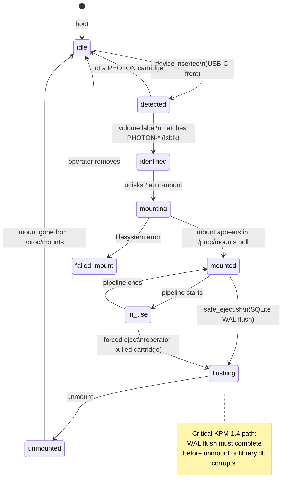
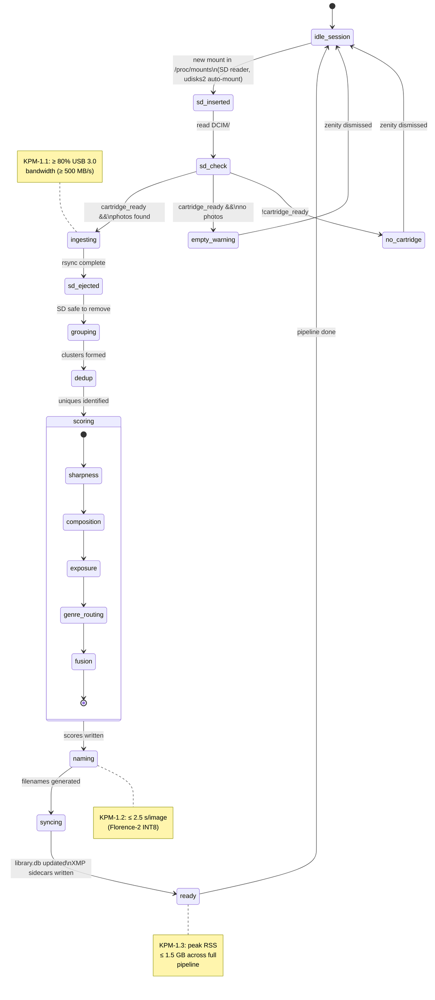

# System State Machine

The SysML **State Machine Diagram** for PHOTONForge. Two concurrent
state machines run side-by-side: the **cartridge lifecycle**
(physical SSD presence) and the **ingest session** (logical workflow
on inserted SD card). They synchronize through the `cartridge_ready`
guard.

## Cartridge Lifecycle

Tracks the physical SSD cartridge (PHOTON-001, etc.) from the
host's perspective. Driven by udisks2 auto-mount + `/proc/mounts`
polling events.

## Ingest Session

Triggered by SD insertion. Runs once per ingest. Independent of cartridge
state machine except for the `cartridge_ready` guard.

## Concurrency

The two state machines synchronize on:

- `cartridge_ready` — true iff cartridge is in `mounted` and not
  `flushing`. The `sd_check` transition reads this.
- `pipeline_running` — true iff the ingest session is between
  `ingesting` and `ready`. The cartridge's `in_use` state reads this;
  a `safe_eject.sh` while `pipeline_running` is true blocks until
  pipeline reaches `ready`.

## SysML traceability

| State / transition | Related requirement |
|---|---|
| `detected → identified` (PHOTON-* match) | FR-1.9 — Library Cartridge Management |
| `mounting → mounted` | NFR-2.3 — Database Portability (library.db must live on the cartridge) |
| `sd_check → ingesting` (cartridge_ready guard) | NFR-2.4 — Interactive UI Prompts |
| `ingesting → sd_ejected` | UN-040 — staging path for safe SD removal |
| `flushing → unmounted` | FR-1.10 — Safe Ejection, KPM-1.4 — Zero corruption |
| `sd_inserted → ingesting` (rsync) | FR-1.1 — Automated Media Ingest, KPM-1.1 |
| `scoring → naming` | FR-1.4..FR-1.7 |
| `naming → syncing` | FR-1.8 — Darktable Integration |
